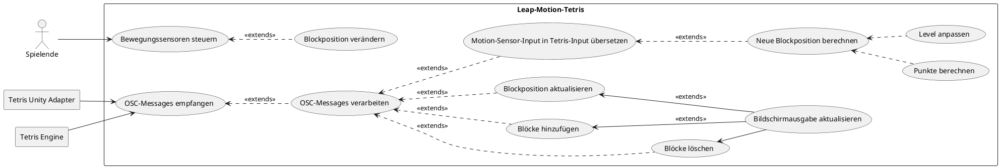

```plantuml
@startuml
left to right direction
actor Spielende

rectangle "Tetris Unity Adapter" as Adapter
rectangle "Tetris Engine" as Engine 
rectangle (Leap-Motion-Tetris) {
  Spielende --> (Bewegungssensoren steuern)
  (Bewegungssensoren steuern) <.. (Blockposition verändern) : <<extends>>
  (Adapter) --> (OSC-Messages empfangen)
  (Engine) --> (OSC-Messages empfangen)
  (OSC-Messages empfangen) <.. (OSC-Messages verarbeiten) : <<extends>>
  (OSC-Messages verarbeiten) <.. (Blöcke löschen) : <<extends>>
  (Blöcke löschen) <- (Bildschirmausgabe aktualisieren) : <<extends>>
  
  (OSC-Messages verarbeiten) <.. (Blöcke hinzufügen) : <<extends>>
  (Blöcke hinzufügen) <-- (Bildschirmausgabe aktualisieren) : <<extends>>
  (OSC-Messages verarbeiten) <.. (Blockposition aktualisieren) : <<extends>>
  (Blockposition aktualisieren) <-- (Bildschirmausgabe aktualisieren) : <<extends>>
  (OSC-Messages verarbeiten) <.. (Motion-Sensor-Input in Tetris-Input übersetzen) : <<extends>>
  (Motion-Sensor-Input in Tetris-Input übersetzen) <.. (Neue Blockposition berechnen) : <<extends>>
  (Neue Blockposition berechnen) <.. (Punkte berechnen)
  (Neue Blockposition berechnen) <.. (Level anpassen)
}

@enduml
```